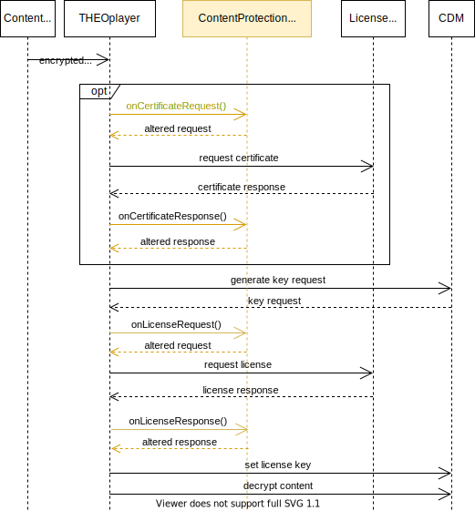

# THEOplayer DRM integrations

### Table of contents

1. [Introduction](#introduction)
2. [DRM flow](#drm-flow)
3. [DRM integration API](#drm-integration-api)
4. [Getting started](#getting-started)

### Introduction

A detailed explanation on why DRM (Digital Rights Management) is necessary, and how it works, can
be found in THEOplayer's [knowledge base](https://docs.theoplayer.com/knowledge-base/02-content-protection/00-introduction.md).
For the purpose of the integration examples in this repository we will first briefly explain some key
concepts being used in the process of requesting a decryption key, or the *DRM flow*.

### DRM flow

The examples in this repository are grouped per platform, but they share a common overall DRM flow. 
Whenever the player encounters encrypted content, it will need a *decryption or license key* to decrypt the content
before it can be played.
This key is requested from a license server by means of a *license acquisition request*.
The actual decryption is done by the *CDM (Content Decryption Module)*, a hardware or software
component external to the player, which creates (part of) the request body (the challenge) to send to the 
server, and takes the resulting key from the response.

Optionally, the license request is preceded by a *certificate request*. The certificate is then used
to encrypt certain parts of the license request itself.

So in the whole DRM process the player just mediates and passes through information between the license 
server and the CDM. The details of this communication is very specific to the type of DRM
being used and the DRM vendor, however. Handling the way the license requests and response bodies are 
formatted, or wrapped with additional information, is called the *DRM integration*. 
Due the vast diversity of integrations a DRM Integration API and this sample repository were created.

### DRM integration API

THEOplayer supports Fairplay, PlayReady and Widevine by default. In many cases however, developers
are working with a multi-DRM vendor that requires a tailored integration approach. 
THEOplayer already includes a large number of pre-integrated solutions through partnerships with multi-DRM vendors.
In addition, because there is no one-fits-all approach, an API is available that allows to build a custom 
DRM integrations. It gives the possibility to alter the DRM process by hooking into key points of the DRM
flow, such as right before creating certificate and license request bodies, or right after
receiving the responses.

The sequence diagram below depicts a simplified version the DRM flow and how a custom integration can intervene
at certain key points.

This repository contains a number of such DRM flows that are already pre-integrated in THEOplayer,
but rewritten as a custom DRM integration. They serve as examples for integrating with the 
THEOplayer Content Protection API.

More information on the integration process can be found in the [how-to guide](https://docs.theoplayer.com/how-to-guides/04-drm/00-introduction.md).

### Getting started
- [Getting started on Web](web/README.md)
- [Getting started on Android](android/README.md)
- [Getting started on iOS](ios/README.md)
