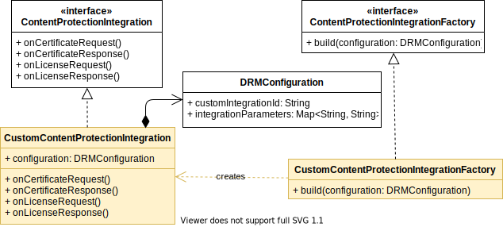

## Getting started on Android

### Table of contents

1. [Overview](#overview)
2. [Creating a new integration](#creating-a-new-integration)
3. [Request and Response types](#request-and-response-types)
4. [Available examples](#available-examples)
5. [Testing an integration](#testing-an-integration)
6. [Conclusion](#conclusion)

### Overview

This document provides a step-by-step approach on how to create a custom DRM integration with the THEOplayer Android SDK.
It gives an overview of which classes are involved and how they participate in the DRM flow.

The project's top-level [README](../README.md) elaborates on what it means to create a DRM integration, gives a brief 
platform-independent overview of the flow, and clarifies the terminology being used throughout the document. Make sure
to familiarise yourself with it before starting your own implementation. 

The static class diagram below depicts classes that are part of the SDK in white, while coloured classes need to be 
implemented when creating a custom integration. The `ContentProtectionIntegrationFactory` subclass is only used once
by THEOplayer to create an instance of a `ContentProtectedIntegration` subclass. The latter contains the actual hook methods
being referred to in the DRM integration [sequence diagram](../README.md#drm-integration-api).



In the next section a custom integration is built by implementing both subclasses. 

### Creating a new integration

First create a custom implementation of [ContentProtectionIntegration](https://theoplayer-cdn.s3.eu-west-1.amazonaws.com/doc/android/latest/com/theoplayer/android/api/contentprotection/ContentProtectionIntegration.html)
in the [com.theoplayer.contentprotectionintegration.integration](/android/app/src/main/java/com/theoplayer/contentprotectionintegration/integration)
package.
This object defines handler methods that allow altering license and certificate requests and responses as part of the
DRM flow.
All methods are optional. They can be omitted if the integration does not require additional action, in which case the
default implementation will be used.

```java
package com.theoplayer.contentprotectionintegration.custom;

import com.theoplayer.android.api.contentprotection.CertificateRequestCallback;
import com.theoplayer.android.api.contentprotection.CertificateResponseCallback;
import com.theoplayer.android.api.contentprotection.ContentProtectionIntegration;
import com.theoplayer.android.api.contentprotection.LicenseRequestCallback;
import com.theoplayer.android.api.contentprotection.LicenseResponseCallback;
import com.theoplayer.android.api.contentprotection.Request;
import com.theoplayer.android.api.contentprotection.Response;
import com.theoplayer.android.api.source.drm.DRMConfiguration;

public class CustomContentProtectionIntegration extends ContentProtectionIntegration {

    private final DRMConfiguration contentProtectionConfiguration;

    public CustomContentProtectionIntegration(DRMConfiguration configuration) {
        this.contentProtectionConfiguration = configuration;
    }

    public void onCertificateRequest(Request request, CertificateRequestCallback callback) {
        callback.request(request);
    }

    public void onCertificateResponse(Response response, CertificateResponseCallback callback) {
        callback.respond(response.getBody());
    }

    public void onLicenseRequest(Request request, LicenseRequestCallback callback) {
        // Optionally apply integration parameters, such as a token, which are passed when setting the source, or
        // add additional header fields.
        // final Object token = this.contentProtectionConfiguration.getIntegrationParameters().get("token");
        // request.getHeaders().put("x-token", token.toString());
        // request.getHeaders().put("Content-Type", "text/plain");
        
        // If required by the DRM provider, wrap or transform the request body.
        // JSONObject jsonBody = new JSONObject();
        // try {
        //    jsonBody.put("drm_info", TypeUtils.fromByteArrayToUint8JsonArray(request.getBody()));
        // } catch (JSONException e) {
        //     e.printStackTrace();
        // }
        // request.setBody(TypeUtils.fromJsonToByteArray(jsonBody));
        
        callback.request(request);
    }

    public void onLicenseResponse(Response response, LicenseResponseCallback callback) {
        callback.respond(response.getBody());
    }
}
```

Optional parameters needed for certificate or license requests, such as tokens, can be added to a
[DRMConfiguration](https://theoplayer-cdn.s3.eu-west-1.amazonaws.com/doc/android/latest/com/theoplayer/android/api/source/drm/DRMConfiguration.html)
object that is passed when creating instances of the `CustomContentProtectionIntegration` class.
In the example, `CustomContentProtectionIntegration` adds a token from the configuration object as part of the headers
during a license request.

Next, create a [ContentProtectionIntegrationFactory](https://theoplayer-cdn.s3.eu-west-1.amazonaws.com/doc/android/latest/com/theoplayer/android/api/contentprotection/ContentProtectionIntegrationFactory.html)
for building CustomContentProtectionIntegration instances.
THEOplayer will use this factory in its DRM flow whenever it needs a ContentProtectionIntegration instance that
matches with the content protected source. How THEOplayer knows which factory to take will be determined in the
`registerContentProtectionIntegration` step next.

```java
package com.theoplayer.contentprotectionintegration.custom;

import com.theoplayer.android.api.contentprotection.ContentProtectionIntegration;
import com.theoplayer.android.api.contentprotection.ContentProtectionIntegrationFactory;
import com.theoplayer.android.api.source.drm.DRMConfiguration;

public class CustomContentProtectionIntegrationFactory implements ContentProtectionIntegrationFactory {
    @Override
    public ContentProtectionIntegration build(DRMConfiguration configuration) {
        return new CustomContentProtectionIntegration(configuration);
    }
}
```

An instance of `CustomContentProtectionIntegrationFactory` needs to be registered with THEOplayer's global instance in the
[SourceManager](/android/app/src/main/java/com/theoplayer/contentprotectionintegration/SourceManager.java)
by specifying a unique `integrationId`, such as `"CUSTOM"` in this example.

```java
String CUSTOM_ID = "CUSTOM";
THEOplayerGlobal.getSharedInstance(context).registerContentProtectionIntegration(
        CUSTOM_ID,
        KeySystemId.WIDEVINE,
        new CustomContentProtectionIntegrationFactory()
);
```

When the player now loads a source with a `customIntegrationId` that matches the `integrationId`
passed during registration, an instance of `CustomContentProtectionIntegration` will be created and used in the DRM flow.

Also add the source description here, which provides the manifest and license URLs along with any integration parameters.

```java
public class SourceManager {

    private void initSources(Context context) {
        // Custom content protect integration
        String CUSTOM_ID = "CUSTOM";
        THEOplayerGlobal.getSharedInstance(context).registerContentProtectionIntegration(
                CUSTOM_ID,
                KeySystemId.WIDEVINE,
                new CustomContentProtectionIntegrationFactory()
        );
        sources.put(
                "Custom Widevine",
                buildWidevineSourceDescription(
                        CUSTOM_ID,
                        "<insert_manifest_here>",
                        "<insert_license_url_here>",
                        new HashMap<String, Object>() {{
                            // optional integration parameters
                            // put("token", "<insert_token_here>");
                        }}
                )
        );
    
        // add other registrations & sources here ...
    }

    private SourceDescription buildWidevineSourceDescription(
            String integrationId,
            String manifestUrl,
            String licenseUrl,
            HashMap<String, Object> integrationParams) {
        return sourceDescription(
                typedSource(manifestUrl)
                        .setNativeRenderingEnabled(true)
                        .setNativeUiRenderingEnabled(false)
                        .drm(new DRMConfiguration.Builder()
                                .customIntegrationId(integrationId)
                                .integrationParameters(integrationParams)
                                .widevine(keySystemConfiguration(licenseUrl).build())
                                .build())
                        .build()
        ).build();
    }
}
```

Finally, build and run the app on an Android device or Android emulator.

### Request and Response types

Manipulating certificate and license requests and responses requires special care. Next to adding header
fields or changing the target url, the body of the `Request` most often needs to be transformed or wrapped 
before passing it along. 

```java
public class Request {
    @NonNull
    public String getUrl();
    public void setUrl(@NonNull String url);
    
    @NonNull
    public RequestMethod getMethod();
    public void setMethod(@NonNull RequestMethod method);
    
    @NonNull
    public Map<String, String> getHeaders();
    public void setHeaders(@NonNull Map<String, String> headers);

    @Nullable
    public byte[] getBody();
    public void setBody(@Nullable byte[] body);
}
```

A `Request` object expects the body to be an array of `byte`. In case of a license request it originally contains the
challenge generated by the CDM.
A common way of passing extra data to the server is by wrapping the raw request body
in a JSON object with some additional properties, which is then transformed back into the required type `byte[]`. The following
example is taken from the [VuDRM integration sample](app/src/main/java/com/theoplayer/contentprotectionintegration/integration/vudrm/VudrmWidevineContentProtectionIntegration.java):

```java
JSONObject jsonBody = new JSONObject();
try {
    jsonBody.put("token", token);
    jsonBody.put("drm_info", TypeUtils.fromByteArrayToUint8JsonArray(request.getBody()));
    jsonBody.put("kid", kid);
} catch (JSONException e) {
    e.printStackTrace();
}
request.setBody(jsonBody.toString().getBytes());
```
where the `fromByteArrayToUint8JsonArray` helper method creates a JSON array from a `byte[]` object.

Similarly, the `Response` object returned from the server contains among others the response headers and the response
body. The latter is again an array of `byte`, containing the certificate or license that will be passed to the CDM.

```java
public interface Response {
    @NonNull
    Request getRequest();

    @NonNull
    String getUrl();

    int getStatus();

    @NonNull
    String getStatusText();

    @NonNull
    Map<String, String> getHeaders();

    @Nullable
    byte[] getBody();
}
```

Depending on the DRM integration, the response body either already is a raw certificate or license that can be passed along as-is, 
or needs to be transformed or unwrapped first in a way similar to the request body.

### Available examples

The repository already contains a few integration examples that could be used as a starting point.

- Vualto VuDRM
- Microsoft Azure DRM
- KeyOS

### Testing an integration

Make sure to apply the following steps before testing your custom integration. If a problem persists, please
reach out to THEOplayer [customer support](https://www.theoplayer.com/contact).

- Depending on the features included in your THEOplayer build, include the necessary dependencies in `/android/app/build.gradle`.
- Open the `/android` folder in [Android Studio](https://developer.android.com/studio) and build the project.
- Ensure that a valid license key is entered in the `AndroidManifest.xml` instead of `"YOUR_LICENSE_HERE"`. More information is available at https://github.com/THEOplayer/theoplayer-sdk-android.
- Make sure to fill in the necessary fields in `SourceManager` for the content integration that will be tested, such as the manifest url and any integration parameters.
- Attach either a physical Android device or start an Android emulator, and run the project.

### Conclusion

This document showed how to create a custom DRM integration for Android using THEOplayer's Content Integration API, 
and register it with THEOplayer. The Android integration API can slightly differ on other platforms, so it is best
to check the platform's specific document.

