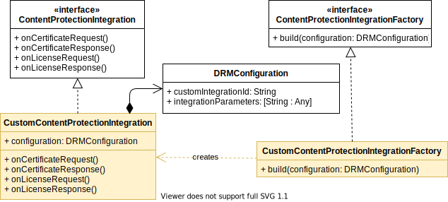

## Getting started on iOS

1. [Overview](#overview)
2. [Creating a new integration](#creating-a-new-integration)
3. [Request and Response types](#request-and-response-types)
4. [Available examples](#available-examples)
5. [Testing an integration](#testing-an-integration)
6. [Conclusion](#conclusion)

### Overview

This document provides a step-by-step approach on how to create a custom DRM integration with the THEOplayer iOS SDK.
It gives an overview of which classes are involved and how they participate in the DRM flow.

The project's top-level [README](../README.md) elaborates on what it means to create a DRM integration, gives a brief
platform-independent overview of the flow, and clarifies the terminology being used throughout the document. Make sure
to familiarise yourself with it before starting your own implementation.

The static class diagram below depicts classes that are part of the SDK in white, while coloured classes need to be
implemented when creating a custom integration. The `ContentProtectionIntegrationFactory` subclass is only used once
by THEOplayer to create an instance of a `ContentProtectedIntegration` subclass. The latter contains the actual hook methods
being referred to in the DRM integration [sequence diagram](../README.md#drm-integration-api).



In the next section a custom integration is built by implementing both subclasses.

### Creating a new integration

First create a custom implementation of [ContentProtectionIntegration](https://theoplayer-cdn.s3.eu-west-1.amazonaws.com/doc/ios/latest/External%20Content%20Protection%20integration%20API.html#/c:@M@THEOplayerSDK@objc(pl)ContentProtectionIntegration)
under `ios/ContentProtectionIntegration/integration`.
This object defines handler methods that allow altering license and certificate requests and responses as part of the
DRM flow.
All methods are optional. They can be omitted if the integration does not require additional action, in which case the
default implementation will be used.

```swift
import Foundation
import THEOplayerSDK

class MyCustomIntegration: ContentProtectionIntegration {
    static let integrationID = "myCustomDRM"
    
    let configuration: DRMConfiguration
    
    init(configuration: DRMConfiguration) {
        self.configuration = configuration
    }

    func onCertificateRequest(request: CertificateRequest, callback: CertificateRequestCallback) {
        callback.request(request: request)
    }

    func onCertificateResponse(response: CertificateResponse, callback: CertificateResponseCallback) {
        callback.respond(certificate: response.body)
    }

    func onLicenseRequest(request: LicenseRequest, callback: LicenseRequestCallback) {
        // request.headers = [
        //     "x-token": self.getTokenFromDrmConfiguration(),
        // ]
        callback.request(request: request)
    }

    func onLicenseResponse(response: LicenseResponse, callback: LicenseResponseCallback) {
        callback.respond(license: response.body)
    }

    func extractFairplayContentId(skdUrl: String) -> String {
        return "<contentId>"
    }

    private func getTokenFromDrmConfiguration() -> String {
        guard let token = self.configuration.integrationParameters?["token"] as? String else {
            fatalError("Could not find the token in the integrationParameters.")
        }
        return token
    }
}
```

Optional parameters needed for certificate or license requests, such as tokens, can be added to a
[DRMConfiguration](https://theoplayer-cdn.s3.eu-west-1.amazonaws.com/doc/ios/latest/Protocols/DRMConfiguration.html)
object that is passed when creating instances of the `MyCustomIntegration` class.
In the example, `MyCustomIntegration` adds a token from the configuration object as part of the headers
during a license request.

Next, create a [ContentProtectionIntegrationFactory](https://theoplayer-cdn.s3.eu-west-1.amazonaws.com/doc/ios/latest/External%20Content%20Protection%20integration%20API.html#/s:13THEOplayerSDK35ContentProtectionIntegrationFactoryP) for building MyCustomIntegration instances.
THEOplayer will use this factory in its DRM flow whenever it needs a ContentProtectionIntegration instance that
matches with the content protected source. How THEOplayer knows which factory to take will be determined in the
`registerContentProtectionIntegration` step next.

```swift
class MyCustomIntegrationFactory: ContentProtectionIntegrationFactory {
    func build(configuration: DRMConfiguration) -> ContentProtectionIntegration {
        return MyCustomIntegration(configuration: configuration)
    }
}
```

An instance of `MyCustomIntegrationFactory` needs to be registered with THEOplayer's global instance in
[AppDelegate](/ios/ContentProtectionIntegration/AppDelegate.swift)
by specifying a unique `integrationId`, such as `"myCustomDRM"` in this example.

```swift
class AppDelegate: UIResponder, UIApplicationDelegate {

    func application(_ application: UIApplication, didFinishLaunchingWithOptions launchOptions: [UIApplication.LaunchOptionsKey: Any]?) -> Bool {
        THEOplayer.registerContentProtectionIntegration(integrationId: MyCustomIntegration.integrationID, keySystem: .FAIRPLAY, integrationFactory: MyCustomIntegrationFactory())
        return true
    }
}
```

When the player now loads a source with a `customIntegrationId` that matches the `integrationId`
passed during registration, an instance of `MyCustomIntegration` will be created and used in the DRM flow.

Also, fill the source description in [ViewController](/ios/ContentProtectionIntegration/ViewController.swift),
which provides the manifest, certificate and license URLs along with any integration parameters.

*Note: The Dictionary ```integrationParameters``` only supports Primitive-types and Codable values. all other types will ignored*
```swift
var sampleSource: SourceDescription {
    return SourceDescription(
        source: TypedSource(
            src: "<insert_manifest_here>",
            type: "application/x-mpegurl",
            drm: FairPlayDRMConfiguration(
                customIntegrationId: MyCustomIntegration.integrationID,
                licenseAcquisitionURL: "<insert_license_url>",
                certificateURL: "<insert_certificate_url>",
                integrationParameters: [
                    // optional integration parameters
                    // "token": "<insert_token>"
                ]
            )
        )
    )
}
```
Finally, build and run the app on an iOS device.

### Request and Response types

Manipulating certificate and license requests and responses requires special care. Next to adding header
fields or changing the target url, the bodies of `CertificateRequest` and`LicenseRequest` most often
need to be transformed or wrapped before passing it along.

```objc
@objc public class CertificateRequest : THEOplayerSDK.Request {
    @objc override public init(
        url: String, 
        method: String, 
        headers: [String : String], 
        body: Data?
    )
    required public init(from decoder: Decoder) throws
}

@objc public class LicenseRequest : THEOplayerSDK.Request {
    @objc public var fairplaySkdUrl: String?
    @objc override public init(
       url: String, 
       method: String,
       headers: [String : String], 
       body: Data?
    )
    @objc public init(
       url: String, 
       method: String, 
       headers: [String : String], 
       body: Data?, 
       fairplaySkdUrl: String?,
       useCredentials: Bool
    )
}
```

Both `CertificateRequest` and `LicenseRequest` objects expect the body to be of byte buffer type
[Data](https://developer.apple.com/documentation/foundation/data).
In case of a license request it originally contains the challenge generated by the CDM.
A common way of passing extra data to the server is by wrapping the raw request body
in a JSON object with some additional properties, which is then transformed back into the required type `Data`. The following
example in Swift is taken from the [VuDRM integration sample](ContentProtectionIntegration/integration/VuDRMIntegration.swift):

```swift
var dict = [String: String]()
dict.updateValue(self.getTokenFromDrmConfiguration(), forKey: "token")
dict.updateValue(contentID, forKey: "contentId")
if let payload = fromDataToBase64String(data: request.body) {
    dict.updateValue(payload, forKey: "payload")
}
do {
    request.body = try JSONEncoder().encode(dict)
    callback.request(request: request)
} catch let error {
    fatalError(error.localizedDescription)
}
```
where the `fromDataToBase64String` helper method creates a base64-encoded string from the request body.

Similarly, `CertificateResponse` and `LicenseResponse` objects returned from the server contain among others the 
response headers and the response body.
The latter is again of type [Data](https://developer.apple.com/documentation/foundation/data),
containing the certificate or license that will be passed to the CDM.

```obj
@objc public class CertificateResponse : THEOplayerSDK.Response {
    @objc public init(
        certificateRequest: THEOplayerSDK.CertificateRequest,
        url: String,
        status: Int,
        statusText: String,
        headers: [String : String],
        body: Data
    )
}

@objc public class LicenseResponse : THEOplayerSDK.Response {
    @objc public init(
        licenseRequest: THEOplayerSDK.LicenseRequest, 
        url: String, 
        status: Int, 
        statusText: String, 
        headers: [String : String], 
        body: Data
    )
}
```

Depending on the DRM integration, the response body either already is a raw certificate or license that can be passed along as-is,
or needs to be transformed or unwrapped first in a way similar to the request body.

### Available examples

- Vualto VuDRM
- Microsoft Azure DRM
- Verizon Uplynk DRM
- EZ DRM
- Verimatrix Core DRM

### Testing an integration

- Ensure that your Podfile is point to an appropriate [THEOplayer iOS SDK](https://github.com/THEOplayer/theoplayer-sdk-ios).
- Run `pod install --repo-update` in the `ios/` folder to install your Podfile.
- Open the `.xcworkspace` file instead of the `.xcodeproj` file.
- Enter a valid license key in `ViewController.swift` instead of `"YOUR_LICENSE_HERE"`.
- Make sure to fill in the necessary fields `ViewController` for the content integration that will be tested, such as the manifest url and any integration parameters.
- Attach an iOS device, and finally build and run the project.

### Conclusion

This document showed how to create a custom DRM integration for iOS using THEOplayer's Content Integration API,
and register it with THEOplayer. The iOS integration API can slightly differ on other platforms, so it is best
to check the platform's specific document.
