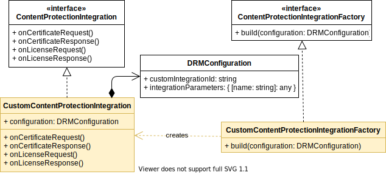

## Getting started on Web

### Table of contents

1. [Overview](#overview)
2. [Creating a new integration](#creating-a-new-integration)
3. [Request and Response types](#request-and-response-types)
4. [Hook return types](#hook-return-types)
5. [Available examples](#available-examples)
6. [Testing an integration](#testing-an-integration)
7. [Conclusion](#conclusion)

### Overview

This document provides a step-by-step approach on how to create a custom DRM integration with the THEOplayer Web SDK.
It gives an overview of which classes are involved and how they participate in the DRM flow.

The project's top-level [README](../README.md) elaborates on what it means to create a DRM integration, gives a brief
platform-independent overview of the flow, and clarifies the terminology being used throughout the document. Make sure
to familiarise yourself with it before starting your own implementation.

The static class diagram below depicts classes that are part of the SDK in white, while coloured classes need to be
implemented when creating a custom integration. The `ContentProtectionIntegrationFactory` subclass is only used once
by THEOplayer to create an instance of a `ContentProtectedIntegration` subclass. The latter contains the actual hook methods
being referred to in the DRM integration [sequence diagram](../README.md#drm-integration-api).



In the next section a custom integration is built by implementing both subclasses.

### Creating a new integration

First create a custom implementation of [ContentProtectionIntegration](https://docs.portal.theoplayer.com/api-reference/web/theoplayer.contentprotectionintegration.md)
under `src/integration/custom`. This object defines handler methods that allow altering license and certificate requests and responses as part of the
DRM flow.
All methods are optional. They can be omitted if the integration does not require additional action, in which case the
default implementation will be used.

```ts 
import {
    ContentProtectionIntegration,
    CertificateRequest,
    MaybeAsync,
    BufferSource,
    CertificateResponse,
    LicenseRequest,
    LicenseResponse
} from 'THEOplayer';
import { CustomDRMConfiguration } from './CustomDRMConfiguration';

export class CustomContentProtectionIntegration implements ContentProtectionIntegration {
    constructor(private readonly contentProtectionConfiguration: CustomDRMConfiguration) {
    }

    onCertificateRequest(request: CertificateRequest): MaybeAsync<Partial<CertificateRequest> | BufferSource> {
        throw new Error('not implemented yet');
    }

    onCertificateResponse(response: CertificateResponse): MaybeAsync<BufferSource> {
        throw new Error('not implemented yet');
    }

    onLicenseRequest(request: LicenseRequest): MaybeAsync<Partial<LicenseRequest> | BufferSource> {
        // const token = this.contentProtectionConfiguration.integrationParameters.token;
        // request.headers = {
        //     ...request.headers,
        //     'x-token': token
        // };
        // return request;
        throw new Error('not implemented yet');
    }

    onLicenseResponse(response: LicenseResponse): MaybeAsync<BufferSource> {
        throw new Error('not implemented yet');
    }
    
    extractFairplayContentId?(skdUrl: string): string {
        throw new Error('not implemented yet');
    }
}
``` 

Optional parameters needed for certificate or license requests, such as tokens, can be added to a [DRMConfiguration](https://docs.portal.theoplayer.com/api-reference/web/theoplayer.drmconfiguration.md/#drmconfiguration-interface)
object that is passed when creating instances of the `CustomContentProtectionIntegration` class.

```ts
import { DRMConfiguration } from 'THEOplayer';

export interface CustomDRMConfiguration extends DRMConfiguration {
    integrationParameters: {
        token: string;
        // any other parameters
    };
}
```

In the example, `CustomContentProtectionIntegration` adds a token from the configuration object as part of the headers
during a license request.

Next, create a [ContentProtectionIntegrationFactory](https://docs.portal.theoplayer.com/api-reference/web/theoplayer.contentprotectionintegrationfactory.md)
for building `CustomContentProtectionIntegration` instances.
THEOplayer will use this factory in its DRM flow whenever it needs a ContentProtectionIntegration instance that
matches with the content protected source. How THEOplayer knows which factory to take will be determined in the
`registerContentProtectionIntegration` step later on.

```ts
import {
    ContentProtectionIntegration,
    ContentProtectionIntegrationFactory,
    DRMConfiguration
} from 'THEOplayer';
import { CustomContentProtectionIntegration } from './CustomContentProtectionIntegration';

export class CustomContentProtectionIntegrationFactory implements ContentProtectionIntegrationFactory {
    build(configuration: CustomDRMConfiguration): ContentProtectionIntegration {
        return new CustomContentProtectionIntegration(configuration);
    }
}
```

Before the factory can be used externally, it needs to be exported in the bundle's entry point `src/index.ts`.

```ts
import { CustomContentProtectionIntegrationFactory } from './integration/custom/CustomContentProtectionIntegrationFactory';

export {
    // ...
    CustomContentProtectionIntegrationFactory
};
``` 

The final step, after updating the integrations library with `npm build`, is creating a web page under `test/custom`.

An instance of `CustomContentProtectionIntegrationFactory` needs to be
[registered](https://docs.portal.theoplayer.com/api-reference/web/theoplayer.registercontentprotectionintegration.md/#registercontentprotectionintegration-function)
with THEOplayer by specifying a unique `integrationId`, such as `'custom_wv'` in this example.

```ts
THEOplayer.registerContentProtectionIntegration(
    'custom_wv',
    'widevine',
    new ContentProtectionIntegrations.CustomContentProtectionIntegrationFactory()
);
``` 
The object `ContentProtectionIntegrations` is provided by the library `dist/bundle.js` and gives access to all exports from `src/index.ts`.

When the player now loads a source with an `integration` parameter that matches the `integrationId`
passed during registration, an instance of `CustomContentProtectionIntegration` will be created and used in the DRM flow.

```html
<!DOCTYPE html>
<html lang="en">
<head>
    <meta charset="UTF-8">
    <title>Custom Widevine Test</title>
    <link rel="stylesheet" type="text/css" href="/THEOplayer/ui.css">
    <script src="/THEOplayer/THEOplayer.js"></script>
    <script src="/dist/bundle.js"></script>
</head>
<body>
<div id="THEOplayer" class="theoplayer-container video-js theoplayer-skin"></div>
<script type="text/javascript">
    const element = document.querySelector('#THEOplayer');
    const player = new THEOplayer.Player(element, {
        ui: {
            fluid: true
        },
        libraryLocation: '/THEOplayer/',
    });

    // Register custom content protection integration
    THEOplayer.registerContentProtectionIntegration(
        'custom_wv',
        'widevine',
        new ContentProtectionIntegrations.CustomContentProtectionIntegrationFactory()
    );

    player.source = {
        sources: [
            {
                src: 'insert manifest url here',
                contentProtection: {
                    widevine: {
                        licenseAcquisitionURL: 'insert license url here'
                    },
                    integration: 'custom_wv',
                    integrationParameters: {
                        token: 'insert token here'
                    },
                    preferredKeySystems: ['widevine', 'playready', 'fairplay']
                }
            }
        ],
    };
</script>
</body>
</html>
``` 

### Request and Response types

Manipulating certificate and license requests and responses requires special care. Next to adding header
fields or changing the target url, the body of the `ContentProtectionRequest` most often needs to be transformed or wrapped
before passing it along.

```javascript   
interface ContentProtectionRequest {
    url: string;
    method: string;
    headers: { [headerName: string]: string };
    body: Uint8Array | null;
    useCredentials: boolean;
}

interface LicenseRequest extends ContentProtectionRequest {
    // Only available for Fairplay license requests. The value will be `undefined` otherwise.
    fairplaySkdUrl: string | undefined;
}

declare type CertificateRequest = ContentProtectionRequest;
```

A `ContentProtectionRequest` object expects the body to be a `Uint8Array`.
In case of a license request it originally contains the challenge generated by the CDM.
A common way of passing extra data to the server is by wrapping the raw request body
in an object with some additional properties, which is then transformed back into the required type `Uint8Array`.
The following example is taken from the [VuDRM Widevine integration sample](./src/integration/vudrm/VudrmWidevineContentProtectionIntegration.ts):

```javascript
private wrapRequestBody(body: Uint8Array): Uint8Array {
    const token = this.contentProtectionConfiguration.integrationParameters.token;
    const drmInfo = fromUint8ArrayToNumberArray(body);
    const kid = this.contentProtectionConfiguration.integrationParameters.keyId;
    return fromObjectToUint8Array({ token, drm_info: drmInfo, kid });
}
```
where `fromUint8ArrayToNumberArray` and `fromObjectToUint8Array` are helper methods transforming variables to different
representations.

Similarly, the `ContentProtectionResponse` object returned from the server contains among others the response headers and the response
body. The latter is again an array of `Uint8Array`, containing the certificate or license that will be passed to the CDM.

```javascript
public interface ContentProtectionResponse {
    request: ContentProtectionRequest;
    url: string;
    status: number;
    statusText: string;
    headers: { [headerName: string]: string };
    body: Uint8Array;
}
```

Depending on the DRM integration, the response body either already is a raw certificate or license that can be passed along as-is,
or needs to be transformed or unwrapped first in a way similar to the request body.

### Hook return types

The return types of both `onCertificateRequest()` and `onLicenseRequest()` hooks are defined as
`MaybeAsync<Partial<CertificateRequest> | BufferSource>` and `MaybeAsync<Partial<LicenseRequest> | BufferSource>`
respectively. This gives the flexibility to either return the optionally modified request, without the need to specify all properties
(i.e. `Partial`), or a raw certificate or license. In the latter case, the request is skipped entirely and the certificate or
license is used directly.

`BufferSource` is defined as the union type `BufferSource = ArrayBufferView | ArrayBuffer`.

For the `onCertificateResponse()` and `onLicenseResponse()` hooks the return type is defined as
`MaybeAsync<BufferSource>`, meaning they are expected to return the raw certificate or license.

### Available examples

- Axinom DRM
- Microsoft Azure DRM
- CastLabs DRMtoday
- Comcast DRM
- EZDRM (only for Fairplay, as Widevine and PlayReady can use the default implementation) 
- Irdeto Control
- BuyDRM KeyOS
- Nagra DRM
- Vualto VuDRM
- Verimatrix MultiDRM Core DRM 
- Arris Titanium DRM

### Testing an integration

- Enter your [THEOplayer license](https://portal.theoplayer.com) instead of `YOUR_LICENSE_HERE` in `src/index.ts`.
- Run `npm install && npm run build` in the root folder to create the integrations library `bundle.js` under `dist/`.
- Start http-server in the root folder by running `npm run server`.
- Go to `localhost:8080/test/[integration you want to test]`.

### Conclusion

This document showed how to create a custom DRM integration for Web using THEOplayer's Content Integration API,
and register it with THEOplayer. The Web integration API can slightly differ on other platforms, so it is best
to check the platform's specific document.
